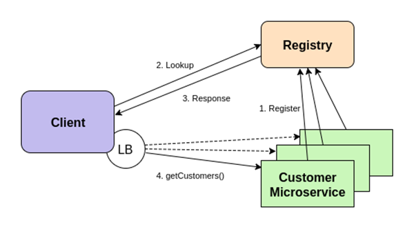

# OCTO-RPC 服务通信框架 #

## 背景 ##
&nbsp;&nbsp;&nbsp;&nbsp;&nbsp;&nbsp;随着分布式技术和微服务思想流行，技术公司逐步将服务拆分为独立运行的小模块，提高系统整体的健壮性，加快特性的演进速度。微服务通过定义完善的接口进行交互，解耦系统、敏捷迭代、方便服务治理。RPC是目前微服务最广泛的通信方式。然而，众多团队各自研发具备服务治理功能的RPC通信框架，一方面增加开发成本，消耗人力重复造轮子；另一方面不同序列化协议的RPC服务，无法互相通信，影响可用性。因此，通用的RPC通信框架能大大提升公司技术团队的研发效率，便于服务治理。

目前美团内部的Mtransport就是一套统一的服务通信框架，为近万个美团应用提供高效的通信服务。

美团致力于将Mtransport定位成一组高性能、高可用的企业级RPC通信框架，现将已在公司广泛使用，成熟稳定的Mtransport进行开源，开源后总名称为Octo-rpc，其中第一批包括Dorado（Java）、Whale（C++）两个语言版本，希望与业内同样有通信框架需求的团队同仁，在Octo-rpc基础上一起打造一款企业级优良的RPC通信框架产品。

## 介绍 ##
  对服务开发者， MTransport 屏蔽了底层网络通信细节，从而更专注于业务自身逻辑实现。支持不同语言版本的代码实现， 保持通信协议的一致性，支持服务注册、服务发现、异步通信、负载均衡等丰富的服务治理功能。
 

 [详见 Dorado（Java）](dorado/README.md)  
 [详见 Whale（C\C++)](whale/README.md)
   

## 未来规划 ##
- 支持更多序列化协议  
- 完善限流、熔断等降级措施     
- 服务端异步   
- 协程，并行计算，流式编程   

希望和各位同行共同打造一款企业级高可用、高可靠的微服务RPC通信基础框架产品，欢迎大家共建。

### Copyright and License

[Apache 2.0 License.](/LICENSE)

### 联系我们

我们需要知道你对octo-rpc的一些看法以及建议：

- Mail: inf.octo.os@meituan.com
- [**Issues**](https://github.com/Meituan-Dianping/octo-rpc/issues)

