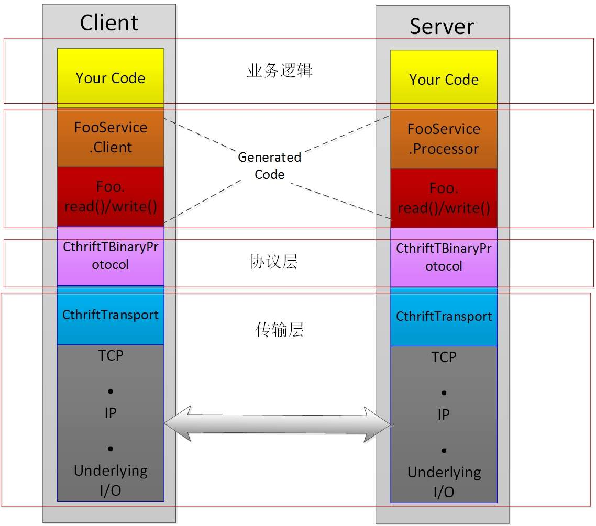
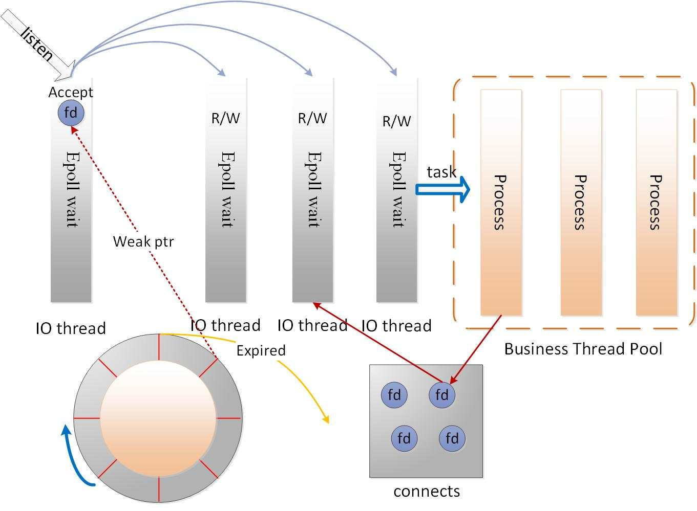
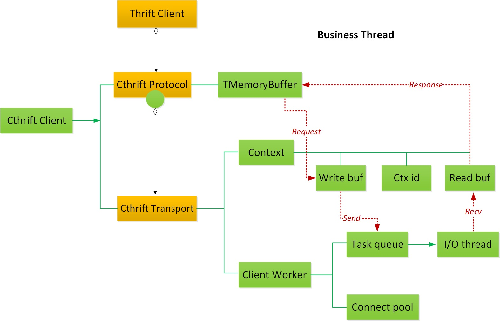
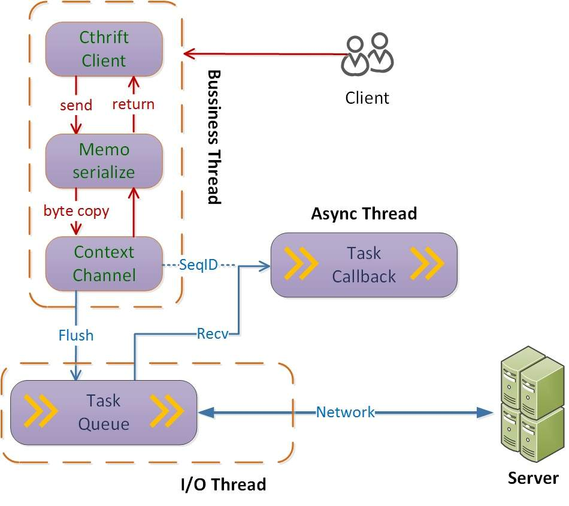
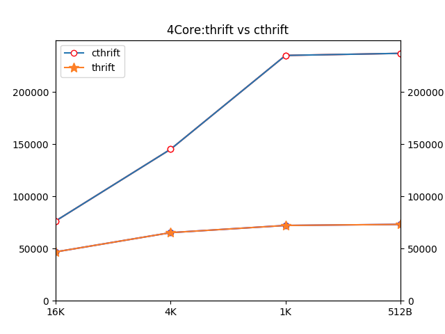

# Whale （OCTORPC C++侧）服务通信框架 #

## 背景 ##
&nbsp;&nbsp;&nbsp;&nbsp;&nbsp;&nbsp;随着分布式技术和微服务思想流行，技术公司逐步将服务拆分为独立运行的小模块，提高系统整体的健壮性，加快特性的演进速度。微服务通过定义完善的接口进行交互，解耦系统、敏捷迭代、方便服务治理。RPC是目前微服务最广泛的通信方式。然而，众多团队各自研发具备服务治理功能的RPC通信框架，一方面增加开发成本，消耗人力重复造轮子；另一方面不同序列化协议的RPC服务，无法互相通信，影响可用性。因此，通用的RPC通信框架能大大提升公司技术团队的研发效率，便于服务治理。

目前美团内部C++服务使用的Cthrift通信框架是在facebook开源的Thrift上持续开发，逐步满足公司内部业务场景需求。

美团致力于将Cthrift打造成一款高性能、高可用的一款企业级RPC通信框架，选择将已经在公司内部使用的较为成熟、稳定的Cthrift进行开源，开源后名称为Whale。希望与业界同仁，共同打造一款企业级优良的RPC通信框架。

## 特点 ##
> - 不同语言服务互相通信

> - 服务注册与发现

> - 简单易用，快速实现RPC通信

> - 资源消耗低，吞吐量高

> - 调用端支持异步通信，避免同步等待

> - 业务线程与IO线程分离，避免业务逻辑阻塞网络吞吐

在典型的微服务场景下构建服务，使用Whale前:

> - 网络收、发包功能，负载均衡，管理IO线程池与链接资源等零碎、易错逻辑

> - 实现服务注册与发现逻辑

> - 协商应用层通信协议

使用Whale后：

> - 仅实现自身的业务逻辑代码  

    Whale在业务层复用了Thrift的中间语言方式，降低接入成本。用户只需要定义好IDL结构后，实现业务代码即可。

## 介绍 ##

### 层级 ###

> 业务代码：业务代码逻辑

> 通信接口：由IDL文件产生，用于业务代码发起通信的相关接口

> 应用协议：应用层协议字段订制

> 网络传输：IO传输相关的线程池、链接资源管理；以及负载均衡等通信逻辑

### 角色 ###

> Server：作为服务端，提供高性能数据吞吐能力；具备服务注册功能。

> Client：作为调用端，具有负载均衡功能与服务发现功能。

### 服务处理 ###
> - MainReactor负责监听连接，Accept连接给SubReactor处理（为什么要单独分一个Reactor来处理监听呢？因为像TCP这样需要经过3次握手才能建立连接，这个建立连接的过程也是要耗时间和资源的，单独分一个Reactor来处理，可以提高性能）

> - SubReactor做网络的IO，收和发送数据包

> - 数据收上来后交给ThreadPool来出来  解码+计算+编码

> - 时间轮：每次创建新Connect时，弱引用指向对应的套接字，连接长期无数据流传输进行移除操作，避免占用服务器资源。

#### 服务请求 ####
Whale调用端的架构贴合模块一节中谈到的四层结构，重新实现了协议层与网络传输逻辑。

> - Thrift Client：业务层代码使用IDL生成的接口发送请求。

> - Cthrift Protocol：扩充应用层通信协议，维护应用层Buffer，并持有传输对象。

> - Client Worker：实际的传输对象，持有IO线程以及连接资源。

RPC请求经过序列化放入协议对象的Buffer中，协议对象调用client_worker创建上下文内容，并且将任务交给IO线程进行网络传输。收到服务端返回的响应包后，IO线程解析协议头匹配上下文信息，将数据流交付对应的请求接口。

服务发现是调用端的一个主要功能，在client_worker中的SG Thread感知服务列表变动状态，对连接池进行更新。服务列表中每个服务节点带有“权重”等信息，IO线程发送数据前使用负载均衡算法从连接池挑选Connect，达到负载均衡需求。

通过Thrift视角审视Whale调用端架构后，后续将通过异步化调用功能更深入的说明Whale的实现。

#### 异步请求 ####
同步RPC是Thrift广应现应用形式，同步通信制约了服务的吞吐能力，难以应对流量不断增加的需求。Thrift虽然支持异步化调用接口，但缺乏完整的功能实现。Whale基于回调机制，向业务提供异步化RPC传输功能。参照上一节调用端的架构介绍，这里从线程角度详细说明了各个模块的工作流程。

> - 业务线程：业务代码调用IDL接口发起RPC请求，进行数据序列化并创建上下文保存回掉函数等内容，Whale会将请求包装成任务放入IO线程的队列中。从业务视角看一次RPC“结束”，可以进行下一次发送操作。

> - IO线程：消费传输任务进行网络传输，收到Response数据后根据上下文ID，取出回掉函数包装成任务放入异步处理队列。

> - 异步处理线程：消费队列任务，使用服务端返回的数据执行业务设置的回掉函数。

三个主要的逻辑异步处理，相互解耦，通过上下文ID进行串联，大大提升服务的吞吐能力。对应Whale的架构来看，IO线程+异步处理线程的逻辑由client_worker进行处理，后文将针对该对象进行优化讨论。

#### 灵活的并发设置 ####
Whale服务端的IO线程和业务工作线程数量，用户可以根据业务场景的不同，设置不同线程的数量。对于调用端据，通过上文的介绍可以知道client_worker持有了大量系统资源，实现数据传输的核心功能。Whale根据业务不同需求场景，针对client_worker的资源管理设置了两种模式。

复用模式：默认场景针对相同服务端进程中创建多个Whale Client对象时，复用同一个client_worker，进而公用连接池和IO线程等资源，避免资源开销。

并发模式：对于需要高并发、高吞吐的场景，关闭client_worker复用，使用多IO线程工作模式提高服务性能。

## 性能指标 ##
### 测试环境 ###
> - processor	: 4  
> - vendor_id	: GenuineIntel  
> - cpu family: 6  
> - model		: 79  
> - model name: Intel(R) Xeon(R) CPU E5-2650 v4 @ 2.20GHz  
> - stepping	: 1  
> - cpu MHz	: 2199.998  
> - cache size: 4096 KB 
 
### 测试方法 ###
PingPong测试，客户端和服务端在不同机器上，客户端向服务端发送一些数据，服务端Echo回这些数据，最后在客户端得出TPS数据，这样尽量简化上层业务逻辑，达到测试框架性能的目的。

两个服务器，一个用Cthrift实现，一个用原生Thrift Nonblocking Server实现(内部使用得是Libevent)。一个客户端，用Whale Client 实现，异步发送请求。

测试的条件变量方面，限定客户端线程数为4， 服务端线程数为4，发送消息字节数分为1K，4K，16K，连接数为100。

同一测试数据维度(例如Whale，发送字节数为1K，为一测试维度)持续发送10分钟，在Server端采集到这段时间的平均TPS值以减轻抖动。

考虑到当前机器状况和网络抖动因素，测得的数值可能有10%左右的误差，但不影响最终的比较意义。
### 测试结果 ###

其中以覆盖绝大多数请求类型的1K数据长度的性能提升最明显。  
从实现代码层面，主要有以下几点原因：

> - Thrift采取的是IO线程 + Worker线程池的模型，中间用消息队列传递(std::queue)， Push和Pop各有一次内存拷贝的开销(详见thrift-0.8.0/lib/cpp/src/concurrency/ThreadManager.cpp)。 
Whale用二级线程模型实现，IO池加Worker池，IO池可以根据是否接收高水位来判断是否需要分配给Worker线程还是自己直接处理来避免两次内存拷贝开销(Netty也用了同样的策略来优化性能)，这样在高频低Load任务(比如小字节Echo)的处理中性能优化很大。

> - Thrift 各个Worker之间从同一个MQ中获取消息, 当消息处理耗时很低，且消息数很高时，锁竞争开销占比明显；
> - Whale 给Worker消息传递任务，使用的是eventfd + 定向循环缓冲队列的方式，工作线程之间基本不存在数据竞争和冲突关系，并行化更彻底。

## 快速使用 ##
[快速开始](docs/Quick_start.md) 

## 未来规划 ##
- 支持更多序列化协议  
- 完善限流、熔断等降级措施     
- 服务端异步   
- 协程，并行计算，流式编程   

希望和各位同行共同打造一款企业级高可用、高可靠的微服务RPC通信基础框架产品，欢迎大家共建。

### Copyright and License

[Apache 2.0 License.](/LICENSE)

### 联系我们

我们需要知道你对OCTORPC的一些看法以及建议：

- Mail: inf.octo.os@meituan.com，
- [**Issues**](https://github.com/Meituan-Dianping/octo-rpc/issues)

